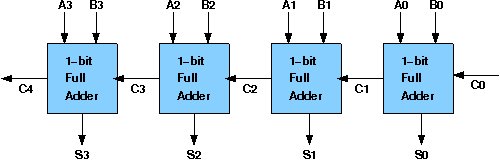

# Theory:

## Design of Ripple Carry Adders :

Arithmetic operations like addition, subtraction, multiplication, division are basic operations to be implemented in digital computers using basic gates likr AND, OR, NOR, NAND etc. Among all the arithmetic operations if we can implement addition then it is easy to perform multiplication (by repeated addition), subtraction (by negating one operand) or division (repeated subtraction).

Half Adders can be used to add two one bit binary numbers. It is also possible to create a logical circuit using multiple full adders to add N-bit binary numbers.Each full adder inputs a **Cin**, which is the ***Cout*** of the previous adder. This kind of adder is a ***Ripple Carry Adder***, since each carry bit **"ripples"** to the next full adder. The first (and only the first) full adder may be replaced by a half adder.The block diagram of 4-bit Ripple Carry Adder is shown here below -

The layout of ripple carry adder is simple, which allows for fast design time; however, the ripple carry adder is relatively slow, since each full adder must wait for the carry bit to be calculated from the previous full adder. The gate delay can easily be calculated by inspection of the full adder circuit. Each full adder requires three levels of logic.In a 32-bit [ripple carry] adder, there are 32 full adders, so the critical path (worst case) delay is 31 * 2(for carry propagation) + 3(for sum) = 65 gate delays.

## Design Issues :

The corresponding boolean expressions are given here to construct a ripple carry adder. In the half adder circuit the sum and carry bits are defined as

    Sum = A ⊕ B

    Carry = AB

In the full adder circuit the the Sum and Carry outpur is defined by inputs A, B and Carryin as

    Sum = ABC + ABC + ABC + ABC

    Carry = ABC + ABC + ABC + ABC

Having these we could design the circuit.But,we first check to see if there are any logically equivalent statements that would lead to a more structured equivalent circuit.

With a little algebraic manipulation,one can see that

    Sum = ABC + ABC + ABC + ABC

        = (AB + AB) C + (AB + AB) C

        = (A ⊕ B) C + (A ⊕ B) C

        = A ⊕ B ⊕ C

    Carry = ABC + ABC + ABC + ABC

          = AB + (AB + AB) C

          = AB + (A ⊕ B) C