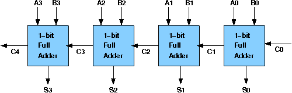

# Procedure

## Assignment Statements :
- Create a half adder circuit using only logic gates and test it by giving proper input.
- Create a full adder circuit using only logic gates and test it by giving proper input.
- Create a full adder circuit using half adder and test it by giving proper input.
- Create a 4-bit ripple carry adder circuit using half adders and full adders and test it by giving proper input.

## Circuit diagram of Ripple Carry Adder:

## Follow the below manual and perform the experiment

- Manual --> [Click Here](./simulation/coavlNew.pdf)

<embed src="./simulation/coavlNew.pdf" type="application/pdf">

